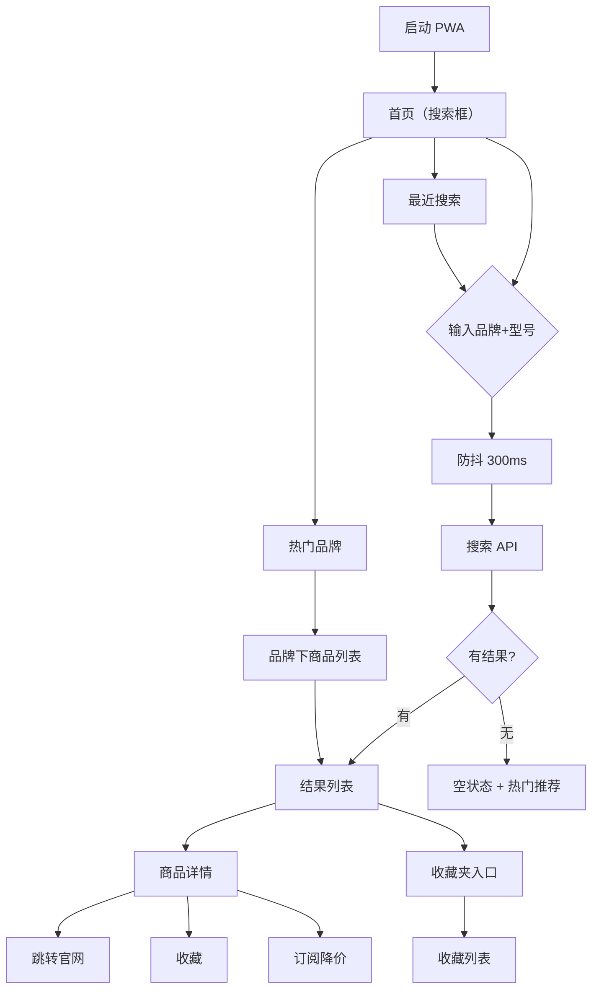

# 海外小众品牌查价 PWA · 产品需求文档 (PRD)

## 1. 产品概述

**BrandPrice** 是一款面向海外时尚买手的小众品牌查价 PWA 移动网页。买手在逛店、跑展会、看秀场时，只需输入「品牌 + 型号」即可秒级查到品牌官方独立站的实时在售价格，并一键直达商品页面。

- **目标用户**：在海外工作的时尚买手、独立设计师买手店选品员、跨境电商采购
- **核心痛点**：小众品牌官网分散、价格货币不一、聚合站加价失真
- **价值主张**：只信官方价、永远直达官网、不绑定购物车、比价 5 秒搞定

## 2. 核心功能

### 2.1 用户角色

| 角色 | 身份 | 核心权限 |
|---|---|---|
| 买手用户 | 个人，无需注册 | 搜索、收藏、订阅降价、查看历史 |

### 2.2 功能模块

1. **首页（搜索入口）**：搜索框、热门品牌快捷入口、最近搜索、降价订阅提醒
2. **搜索结果页**：商品价格卡片列表、品牌筛选、排序
3. **商品详情页**：价格、官网原价、库存状态、官网跳转按钮、价格历史曲线、收藏/订阅
4. **收藏夹**：已收藏商品价格卡片、价格走势小图
5. **价格历史页**：选定时间区间内的价格变化曲线
6. **设置页**：显示货币、主题（浅色/深色/自动）、搜索历史清除

### 2.3 页面详情

| 页面名称 | 模块名称 | 功能描述 |
|---|---|---|
| 首页 | 搜索框 | 顶部固定，自动聚焦，支持语音输入 |
| 首页 | 热门品牌 | 横向滚动 chip，10 个高频小众品牌一键进入 |
| 首页 | 最近搜索 | 最近 20 条，可单击复用，可长按删除 |
| 首页 | 降价提醒 | 已订阅商品中今日降价项推送 |
| 搜索结果 | 商品卡 | 缩略图、品牌名、型号、价格、货币、在售状态、跳转按钮 |
| 搜索结果 | 排序 | 最新 / 价格升序 / 价格降序 |
| 搜索结果 | 筛选 | 品牌多选、是否有货、货币 |
| 商品详情 | 价签区 | 当前价、原价、汇率换算、最后更新时间 |
| 商品详情 | 跳转按钮 | 大尺寸 CTA：前往官网购买 |
| 商品详情 | 价格历史 | 30/90/180 天 sparkline + 时间序列图 |
| 商品详情 | 订阅降价 | 弹窗：输入目标价 / 选择百分比阈值 |
| 收藏夹 | 商品列表 | 收藏过的商品卡 + 当前价 vs 入收藏时价对比 |
| 设置 | 货币 | 12 种主流货币切换（USD/EUR/GBP/JPY/CNY/KRW …） |
| 设置 | 主题 | 浅色 / 深色 / 跟随系统 |
| 设置 | 数据 | 清除历史、清除缓存、导出收藏 |

## 3. 核心流程

### 3.1 主流程：搜索 → 跳转

```
用户进入 PWA
   ↓
首页自动聚焦搜索框
   ↓
输入「Lemaire Croissant Bag」
   ↓
防抖 300ms 后调用搜索 API
   ↓
返回结果列表（≤ 10 条）
   ↓
点击某条商品卡
   ↓
进入商品详情页
   ↓
点击「前往官网购买」 → 新标签页打开品牌官网商品页
   ↓
（可选）点击 ❤️ 收藏 / 订阅降价
```

### 3.2 流程图



## 4. 用户界面设计

### 4.1 设计风格

- **整体调性**：Editorial Brutalism（编辑式粗野主义）—— 致敬《032c》《SYSTEM》《DAZED》式的杂志感
- **核心隐喻**：像在翻一本高端时尚杂志的「价格索引」专页
- **主色**：纸白 `#F5F2EC`（暖白，非冷白）
- **辅色**：墨黑 `#0A0A0A`、水泥灰 `#9A9A9A`
- **强调色（价格红）**：朱砂红 `#D63A2F`（仅用于价格与 CTA 按钮）
- **次强调**：芥末黄 `#C9A227`（用于"降价"标签）
- **字体**：
  - 标题：衬线大字 **Fraunces**（Variable Serif，现代可变字体）
  - 正文：人文无衬线 **Inter Tight**
  - 价格/数字：等宽 **JetBrains Mono**（保留价格标签的工业感）
- **布局**：非对称网格、大量留白、章节式分隔（粗黑横线 + 编号 + 标题）
- **按钮**：方角 0px 圆角，黑色实底 + 白字；次级按钮为 1px 黑色描边
- **图标**：线性 1.5px 描边，**lucide-react**
- **动效**：翻页式进场（Y 轴 12px → 0，opacity 0 → 1，stagger 60ms），价格数字用 `font-feature-settings: 'tnum'` 保证对齐

### 4.2 页面设计概览

| 页面名称 | 模块名称 | UI 元素 |
|---|---|---|
| 首页 | 顶部 Logo | 左侧 "BRAND/PRICE" 衬线粗体，右侧 收藏 / 设置 图标 |
| 首页 | 章节编号 | "§ 01" 灰色 11px 衬线斜体 |
| 首页 | 搜索框 | 1px 黑色下边框，输入时变 2px 黑色 |
| 首页 | 热门品牌 | 横向滚动 chip，方角，无填充，1px 边框 |
| 首页 | 最近搜索 | 列表式：左侧品牌名（衬线粗体），右侧型号（等宽）+ 时间 |
| 搜索结果 | 顶部状态栏 | "找到 N 个结果 / 用时 X ms" |
| 搜索结果 | 商品卡 | 缩略图（300px 方角）+ 品牌+型号+价签 |
| 商品详情 | 价签区 | 大数字（48px JetBrains Mono），下方法币换算小字 |
| 商品详情 | 跳转 CTA | 全宽方角黑底，"VISIT OFFICIAL SITE →" 衬线大写 |
| 商品详情 | 价格历史 | SVG sparkline，关键节点标 dot |
| 收藏夹 | 卡片 | 缩略图 + 价签 + 入收藏时价对比（涨绿跌红） |
| 设置 | 列表 | 章节式，每行左标签右值，1px 分割线 |

### 4.3 响应式设计

- **Mobile-first**：以 iPhone 14 Pro (393×852) 为基准
- **断点**：
  - `< 640px`：单列
  - `640px – 1024px`：商品列表 2 列
  - `> 1024px`：3 列 + 侧栏
- **触摸优化**：所有可点击元素 ≥ 44×44px
- **安全区**：底部 nav 预留 iOS home indicator 高度 34px

### 4.4 PWA 特性

- **Web App Manifest**：name、short_name、icons (192/512)、theme_color、display: standalone
- **Service Worker**：vite-plugin-pwa 自动生成，缓存策略：
  - 静态资源：CacheFirst
  - API 响应：StaleWhileRevalidate，TTL 5 分钟
  - 搜索结果页：NetworkFirst 兜底
- **离线体验**：无网时显示最后一次搜索结果 + "OFFLINE" 角标
- **添加到主屏**：iOS Safari 与 Android Chrome 都会触发原生提示
- **推送**：Web Push API 发送降价通知（v2）
- **主题色**：浅色模式纸白 + 墨黑；深色模式墨黑 + 纸白文字 + 朱砂红保留

## 5. 数据范围（Mock 数据）

为保证 PWA 可独立运行，前端内置 5 个头部小众品牌、每个品牌 6–10 个商品、共约 40 条 mock 数据：

- **Lemaire**（法国）
- **Acne Studios**（瑞典）
- **Our Legacy**（瑞典）
- **Jil Sander**（德国）
- **032c**（德国）

数据结构包含：brand、sku、name、color、currency、price、originalPrice、inStock、url、image、fetchedAt、priceHistory（30 天每日价格）。
