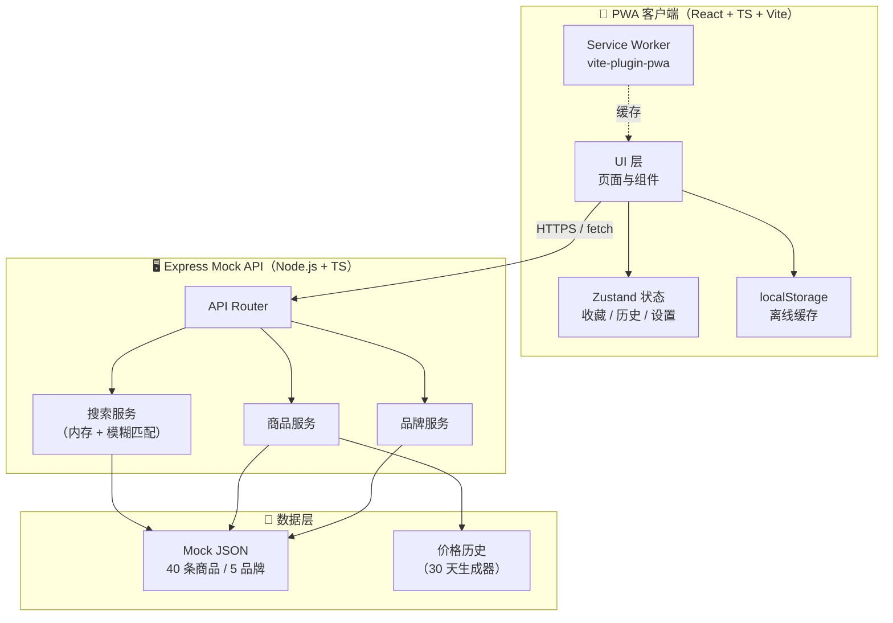
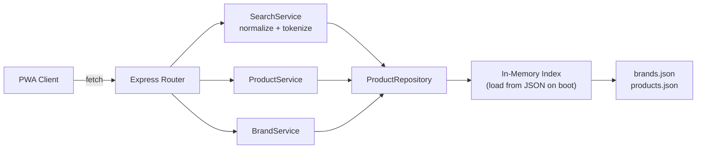
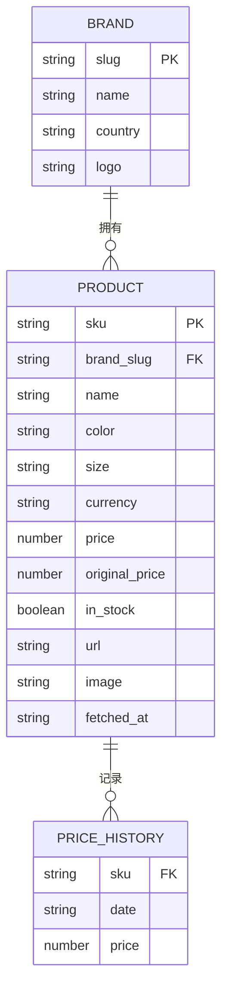

# 海外小众品牌查价 PWA · 技术架构文档

## 1. 架构设计



## 2. 技术栈说明

- **前端**：React@18 + TypeScript@5 + Vite@5
- **样式**：Tailwind CSS@3（自定义设计 token：纸白 / 墨黑 / 朱砂红）
- **字体**：Fraunces（Variable Serif）+ Inter Tight + JetBrains Mono（Google Fonts）
- **状态管理**：Zustand@4
- **路由**：react-router-dom@6
- **PWA**：vite-plugin-pwa@0.20（Workbox 底层，自动注册 Service Worker）
- **图标**：lucide-react
- **后端**：Express@4 + TypeScript（mock API，预留真实抓取服务接口）
- **数据**：内置 JSON mock + 启动时注入内存索引
- **包管理**：npm
- **初始化模板**：`react-express-ts`

## 3. 路由定义

| 路径 | 用途 | 渲染 |
|---|---|---|
| `/` | 首页（搜索入口） | `HomePage` |
| `/search?q=` | 搜索结果列表 | `SearchPage` |
| `/product/:sku` | 商品详情页 | `ProductDetailPage` |
| `/brand/:slug` | 品牌下商品列表 | `BrandPage` |
| `/favorites` | 收藏夹 | `FavoritesPage` |
| `/history` | 全部搜索历史 | `HistoryPage` |
| `/settings` | 设置页 | `SettingsPage` |
| `*` | 404 回退 | `NotFoundPage` |

## 4. API 定义

### 4.1 通用响应

```typescript
type ApiResponse<T> = {
  code: number;       // 0 = 成功
  message: string;
  data: T;
};

type Product = {
  sku: string;
  brand: string;
  brandSlug: string;
  name: string;
  color: string;
  size: string | null;
  currency: 'EUR' | 'USD' | 'GBP' | 'JPY' | 'CNY' | 'KRW';
  price: number;
  originalPrice: number;
  inStock: boolean;
  url: string;
  image: string;
  fetchedAt: string;     // ISO
  priceHistory: { date: string; price: number }[];  // 30 天
};
```

### 4.2 端点

| Method | Path | 入参 | 出参 | 说明 |
|---|---|---|---|---|
| GET | `/api/v1/search` | `q: string` | `Product[]` | 全文搜索（品牌/型号/颜色） |
| GET | `/api/v1/products/:sku` | path | `Product` | 商品详情 |
| GET | `/api/v1/products/:sku/history` | `days?: number` | `{date, price}[]` | 价格历史 |
| GET | `/api/v1/brands` | — | `{slug, name, country, logo}[]` | 全部品牌 |
| GET | `/api/v1/brands/:slug/products` | — | `Product[]` | 品牌下商品 |
| GET | `/api/v1/brands/popular` | — | `Brand[]` | 热门品牌 Top 10 |

### 4.3 搜索示例

请求：
```
GET /api/v1/search?q=lemaire%20croissant
```

响应：
```json
{
  "code": 0,
  "message": "ok",
  "data": [
    {
      "sku": "JA12GR043-1393",
      "brand": "Lemaire",
      "brandSlug": "lemaire",
      "name": "Croissant Bag Small",
      "color": "Camel",
      "size": null,
      "currency": "EUR",
      "price": 950,
      "originalPrice": 950,
      "inStock": true,
      "url": "https://www.lemaire.fr/products/ja12gr043-1393",
      "image": "https://images.brandprice.app/lemaire/ja12gr043-1393.jpg",
      "fetchedAt": "2026-07-08T10:23:11Z",
      "priceHistory": [
        { "date": "2026-06-08", "price": 950 },
        { "date": "2026-06-15", "price": 950 }
      ]
    }
  ]
}
```

## 5. 服务端架构图



服务层单文件薄封装，MVP 不引入 ORM；后续接真实抓取服务时只需替换 `ProductRepository` 实现。

## 6. 数据模型

### 6.1 模型定义



### 6.2 数据初始化

后端启动时读取 `api/data/brands.json` 与 `api/data/products.json`，构建内存索引（Map<sku, Product>、Map<slug, Brand>），价格历史在首次请求时按基础价 ±5% 随机生成 30 天序列并缓存。

### 6.3 货币换算

内置静态汇率表（在 `api/utils/fx.ts`），每条价格响应里附带 `currency` 与 `price`，前端按用户偏好货币实时换算并展示，不在 API 层做换算（保持数据来源单一）。

## 7. PWA 关键配置

`vite.config.ts` 中：

```typescript
VitePWA({
  registerType: 'autoUpdate',
  includeAssets: ['favicon.svg', 'apple-touch-icon.png'],
  manifest: {
    name: 'BrandPrice',
    short_name: 'BrandPrice',
    description: '海外小众品牌官网实时查价',
    theme_color: '#0A0A0A',
    background_color: '#F5F2EC',
    display: 'standalone',
    orientation: 'portrait',
    start_url: '/',
    icons: [
      { src: '/icons/icon-192.png', sizes: '192x192', type: 'image/png' },
      { src: '/icons/icon-512.png', sizes: '512x512', type: 'image/png' }
    ]
  },
  workbox: {
    runtimeCaching: [
      {
        urlPattern: /^https:\/\/fonts\.googleapis\.com/,
        handler: 'CacheFirst',
        options: { cacheName: 'google-fonts', expiration: { maxAgeSeconds: 60*60*24*365 } }
      },
      {
        urlPattern: /\/api\/v1\/.*/,
        handler: 'StaleWhileRevalidate',
        options: { cacheName: 'api-cache', expiration: { maxAgeSeconds: 60*5 } }
      }
    ]
  }
})
```

## 8. 目录结构

```
brandprice/
├── public/
│   ├── icons/
│   ├── favicon.svg
│   └── apple-touch-icon.png
├── api/                              # Express mock 后端
│   ├── data/
│   │   ├── brands.json
│   │   └── products.json
│   ├── routes/
│   │   ├── search.ts
│   │   ├── products.ts
│   │   └── brands.ts
│   ├── services/
│   │   ├── searchService.ts
│   │   ├── productService.ts
│   │   └── brandService.ts
│   ├── utils/
│   │   └── fx.ts
│   └── index.ts                      # Express 入口
├── src/
│   ├── components/
│   │   ├── BottomNav.tsx
│   │   ├── PriceTag.tsx
│   │   ├── ProductCard.tsx
│   │   ├── SearchBar.tsx
│   │   ├── BrandChip.tsx
│   │   ├── Sparkline.tsx
│   │   └── SectionHeader.tsx
│   ├── pages/
│   │   ├── HomePage.tsx
│   │   ├── SearchPage.tsx
│   │   ├── ProductDetailPage.tsx
│   │   ├── BrandPage.tsx
│   │   ├── FavoritesPage.tsx
│   │   ├── HistoryPage.tsx
│   │   ├── SettingsPage.tsx
│   │   └── NotFoundPage.tsx
│   ├── store/
│   │   ├── useFavoritesStore.ts
│   │   ├── useHistoryStore.ts
│   │   └── useSettingsStore.ts
│   ├── hooks/
│   │   ├── useSearch.ts
│   │   ├── useProduct.ts
│   │   └── useFx.ts
│   ├── lib/
│   │   ├── api.ts                    # fetch 封装
│   │   ├── format.ts                 # 货币 / 数字格式化
│   │   └── types.ts                  # 共享 TS 类型
│   ├── styles/
│   │   └── index.css                 # Tailwind + 自定义
│   ├── App.tsx
│   └── main.tsx
├── index.html
├── package.json
├── tailwind.config.js
├── vite.config.ts
└── tsconfig.json
```

## 9. 性能与可访问性

- 关键 CSS 内联（Vite 默认）
- 字体子集 + `font-display: swap`
- 图片懒加载（`loading="lazy"` + IntersectionObserver）
- 触摸目标 ≥ 44×44px
- 语义化 HTML：`<main>` `<nav>` `<button>` `<a>`，配合 ARIA
- 键盘可达：所有交互可 Tab + Enter
- 主题色 + meta theme-color 同步系统状态栏
